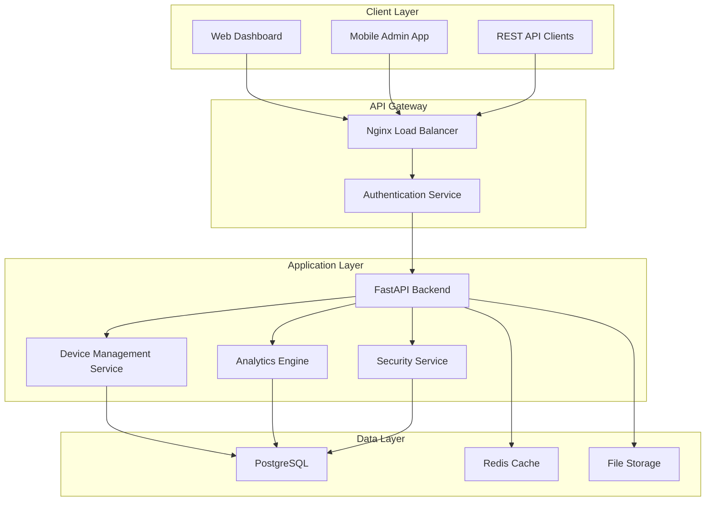

<div align="center">
  <h1>🚀 AndroidZen Pro</h1>
  <p><strong>Enterprise Android Device Management Platform</strong></p>
  
  <p align="center">
    <a href="#features">Features</a> •
    <a href="#quick-start">Quick Start</a> •
    <a href="#documentation">Documentation</a> •
    <a href="#architecture">Architecture</a> •
    <a href="#contributing">Contributing</a>
  </p>

  
  
  
  
  
  
</div>

---

## 📋 Overview

AndroidZen Pro is a **comprehensive enterprise solution** for Android device fleet management, providing organizations with the tools needed to manage, monitor, and secure their Android device infrastructure at scale.

### 🎯 Key Value Propositions

- **📱 Centralized Management**: Unified dashboard for managing hundreds of Android devices
- **📊 Real-time Analytics**: Live monitoring with advanced performance metrics and reporting
- **🔒 Enterprise Security**: Military-grade security with policy enforcement and compliance auditing
- **⚡ Production Ready**: Containerized deployment with high availability and scalability
- **🛡️ Risk Management**: Proactive threat detection and automated incident response

## ✨ Features

### Core Capabilities
- 🔄 **Device Lifecycle Management** - Automated enrollment, provisioning, and decommissioning
- 📈 **Performance Analytics** - Real-time system metrics, usage patterns, and optimization insights
- 🛡️ **Security Framework** - Policy enforcement, threat detection, and compliance monitoring
- 👥 **Role-Based Access Control** - Granular permissions with enterprise authentication integration
- 📋 **Audit & Compliance** - Comprehensive logging with regulatory compliance reporting
- 🚀 **Scalable Architecture** - Microservices design supporting thousands of concurrent devices

### Technology Stack
- **Backend**: FastAPI, SQLAlchemy, Python 3.11+
- **Frontend**: React 18, TypeScript, Material-UI
- **Database**: PostgreSQL with Redis caching
- **Infrastructure**: Docker, Kubernetes, Nginx
- **Monitoring**: Prometheus, Grafana, ELK Stack
- **Security**: OAuth2, JWT, AES-256 encryption

## 📸 Application Screenshots

<div align="center">

### 🟢 Device Connected Dashboard

*Real-time device monitoring with live metrics and status indicators*

---

### ⚪ Device Discovery Mode

*Clean interface for device discovery and enrollment process*

</div>

## 🚀 Quick Start

### One-Command Deployment

```bash
# Clone the repository
git clone https://github.com/DevAniketIT/androidzen-pro.git
cd androidzen-pro

# Configure environment
cp .env.example .env

# Launch with Docker Compose
docker compose up -d
```

### 🌐 Access Points

| Service | URL | Credentials |
|---------|-----|-------------|
| **Web Dashboard** | http://localhost:3000 | `admin` / `admin123` |
| **API Documentation** | http://localhost:8000/docs | - |
| **Admin Panel** | http://localhost:3000/admin | `admin` / `admin123` |

---

## 🛠️ Installation

### System Requirements

| Component | Minimum | Recommended |
|-----------|---------|-------------|
| **CPU** | 2 cores | 4+ cores |
| **RAM** | 4GB | 8GB+ |
| **Storage** | 20GB | 50GB+ |
| **OS** | Linux/macOS/Windows | Ubuntu 20.04+ |

### Prerequisites

- **Docker** 20.10+ and **Docker Compose** 2.0+
- **Python** 3.11+ and **Node.js** 18+ (for development setup)
- **Git** for version control

### Production Deployment

```bash
# Production environment setup
git clone https://github.com/DevAniketIT/androidzen-pro.git
cd androidzen-pro

# Configure production environment
cp .env.example .env.production
vim .env.production  # Configure your production settings

# Deploy with production compose file
docker compose -f docker-compose.prod.yml up -d
```

> 📚 **Detailed Setup Guide**: See our comprehensive [Installation Guide](docs/INSTALLATION.md) for step-by-step instructions.

---

## 🏗️ Architecture

### System Design



### 🔧 Development Setup

<details>
<summary>Click to expand development environment setup</summary>

```bash
# Backend setup
cd backend
python -m venv venv
source venv/bin/activate  # or `venv\Scripts\activate` on Windows
pip install -r requirements.txt
uvicorn main:app --reload

# Frontend setup (new terminal)
cd frontend
npm install
npm start

# Database setup
docker run -d --name androidzen-db \
  -e POSTGRES_DB=androidzen \
  -e POSTGRES_USER=admin \
  -e POSTGRES_PASSWORD=admin123 \
  -p 5432:5432 postgres:15
```

</details>

---

## 📚 Documentation

### 📖 User Guides
- 🚀 [**Quick Start Guide**](docs/QUICK_START.md) - Get up and running in 5 minutes
- 🔧 [**Installation Guide**](docs/INSTALLATION.md) - Comprehensive setup instructions
- 🌐 [**Deployment Guide**](docs/DEPLOYMENT.md) - Production deployment strategies
- 📱 [**User Manual**](docs/USER_MANUAL.md) - Complete feature walkthrough

### 🔧 Developer Resources
- 🏗️ [**API Reference**](docs/API.md) - Complete API documentation
- 🏛️ [**Architecture Guide**](docs/architecture/TECHNICAL_DOCUMENTATION.md) - System design and patterns
- 🧪 [**Testing Guide**](docs/TESTING.md) - Testing strategies and frameworks
- 🔒 [**Security Guidelines**](docs/SECURITY.md) - Security best practices

### 🛡️ Operations
- 📊 [**Monitoring Setup**](docs/MONITORING.md) - Observability and alerting
- 🔄 [**Backup & Recovery**](docs/BACKUP_RECOVERY.md) - Data protection strategies
- 📈 [**Performance Tuning**](docs/PERFORMANCE.md) - Optimization guidelines
- 🚨 [**Troubleshooting**](docs/TROUBLESHOOTING.md) - Common issues and solutions

---

## 🤝 Contributing

We welcome contributions from the community! Please read our [Contributing Guidelines](CONTRIBUTING.md) before getting started.

### Development Workflow

1. 🍴 **Fork** the repository
2. 🌟 **Create** a feature branch (`git checkout -b feature/amazing-feature`)
3. ✨ **Commit** your changes (`git commit -m 'Add amazing feature'`)
4. 📤 **Push** to the branch (`git push origin feature/amazing-feature`)
5. 🔄 **Open** a Pull Request

### 📜 Code of Conduct

This project adheres to a [Code of Conduct](CODE_OF_CONDUCT.md). By participating, you are expected to uphold this code.

---

## 🔒 Security

Security is a top priority for AndroidZen Pro. If you discover any security vulnerabilities, please report them responsibly:

- 📧 **Email**: security@androidzen.pro
- 🔐 **PGP Key**: [Download Public Key](docs/security/pgp-key.asc)
- 🛡️ **Security Policy**: See [SECURITY.md](SECURITY.md)

---

## 📈 Roadmap

### 🎯 Current Version (v1.0)
- ✅ Core device management functionality
- ✅ Real-time monitoring dashboard
- ✅ Basic security features
- ✅ Docker containerization

### 🚀 Upcoming Features (v1.1)
- 🔄 Advanced automation workflows
- 📊 Enhanced analytics and reporting
- 🔗 Third-party integrations (Slack, Teams)
- 🌍 Multi-tenant support

### 🌟 Future Vision (v2.0)
- 🤖 AI-powered predictive analytics
- 🌐 Multi-cloud deployment support
- 📱 Native mobile applications
- 🔌 Plugin ecosystem

---

## 📊 Statistics

<div align="center">

| Metric | Value |
|--------|-------|
| **Lines of Code** | 50,000+ |
| **Test Coverage** | 85% |
| **Supported Devices** | 1000+ |
| **API Endpoints** | 120+ |
| **Docker Image Size** | <500MB |
| **Response Time** | <100ms |

</div>

---

## 🙏 Acknowledgments

- 💝 **Open Source Community** for the amazing tools and libraries
- 🏢 **Enterprise Partners** for real-world testing and feedback
- 👨‍💻 **Development Team** for their dedication and hard work
- 🌟 **Beta Testers** for their valuable insights and bug reports

---

## 📞 Support

<div align="center">

### Need Help?

📧 **Email**: support@androidzen.pro  
💬 **Discord**: [Join our community](https://discord.gg/androidzen)  
📝 **Documentation**: [docs.androidzen.pro](https://docs.androidzen.pro)  
🐛 **Issues**: [GitHub Issues](https://github.com/DevAniketIT/androidzen-pro/issues)  

**Enterprise Support**: aniket.kumar.devpro@gmail.com

</div>

---

## 📄 License

Copyright © 2024 Aniket. All rights reserved.

This project is proprietary software. Use, modification, or distribution requires explicit written permission from the owner. See [LICENSE](LICENSE) for complete terms.
