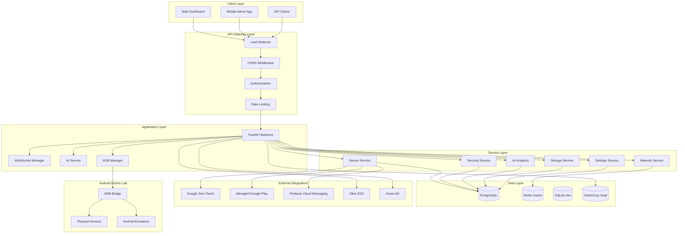
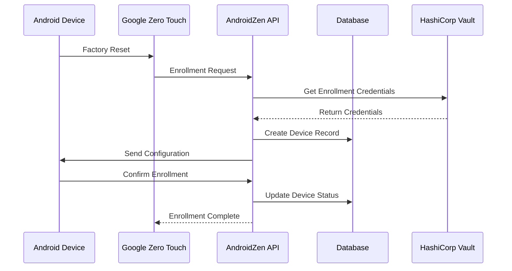
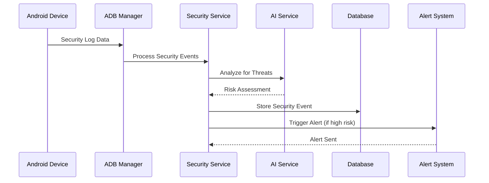
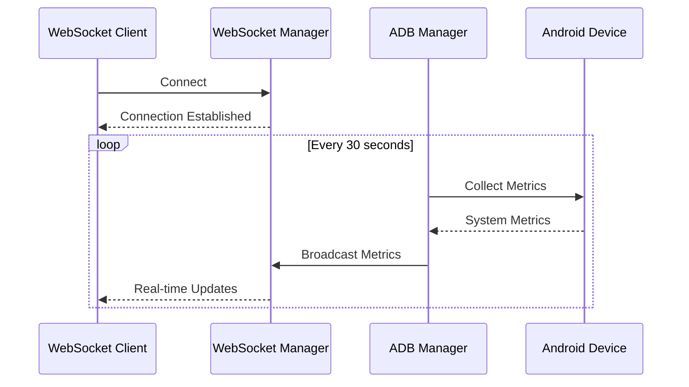
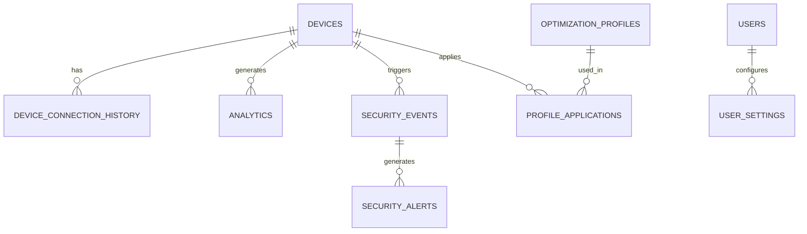

# AndroidZen Pro - System Architecture Documentation

## Executive Summary

AndroidZen Pro is a comprehensive Android Device Management (MDM) and optimization platform designed with a microservices-oriented architecture. The system provides enterprise-grade device management capabilities including enrollment flows, policy management, app distribution, compliance monitoring, security analysis, and real-time device optimization.

## Architecture Overview

### High-Level Architecture



## Trust Boundaries

### Network Trust Boundaries

1. **Internet → API Gateway**
   - HTTPS/TLS 1.3 termination
   - DDoS protection and rate limiting
   - WAF (Web Application Firewall)
   - Geographic filtering

2. **API Gateway → Application Layer**
   - Internal network (VPC/Private subnet)
   - mTLS between services
   - Network policies restrict cross-service communication

3. **Application Layer → Data Layer**
   - Database network isolation
   - Connection pooling with authentication
   - Encrypted connections (TLS)
   - Credential rotation from Vault

4. **Application Layer → External Services**
   - OAuth 2.0/OpenID Connect flows
   - API key management through Vault
   - Certificate-based authentication
   - Network egress filtering

5. **ADB Manager → Device Lab**
   - Isolated device lab network (192.168.1.0/24)
   - ADB over TCP with authentication
   - Device certificate-based trust

### Security Trust Levels

- **Level 0 (Public)**: Web dashboard, public APIs
- **Level 1 (Authenticated)**: User-specific data and operations
- **Level 2 (Privileged)**: Admin operations, device management
- **Level 3 (System)**: Internal service communication, database access
- **Level 4 (Critical)**: Vault secrets, device lab access, external integrations

## Data Flow Architecture

### Device Enrollment Flow



### Security Event Processing



### Real-time Monitoring Flow



## Component Architecture

### Backend Application Structure

```
backend/
├── main.py                    # FastAPI application entry point
├── api/                       # REST API endpoints
│   ├── auth.py               # Authentication endpoints
│   ├── devices.py            # Device management APIs
│   ├── security.py           # Security monitoring APIs
│   ├── storage.py            # Storage management APIs
│   ├── settings.py           # Settings management APIs
│   ├── network.py            # Network operations APIs
│   ├── websocket.py          # WebSocket endpoints
│   ├── ai_analytics.py       # AI-powered analytics APIs
│   └── monitoring.py         # System monitoring APIs
├── core/                      # Core system components
│   ├── database.py           # Database connection and models
│   ├── auth.py               # Authentication and authorization
│   ├── adb_manager.py        # ADB connection management
│   ├── websocket_manager.py  # WebSocket connection handling
│   └── logging_config.py     # Comprehensive logging setup
├── services/                  # Business logic services
│   ├── ai_service.py         # AI/ML analytics service
│   ├── security_service.py   # Security analysis service
│   ├── network_service.py    # Network management service
│   ├── storage_service.py    # Storage analysis service
│   └── settings_service.py   # Settings management service
├── models/                    # Data models and schemas
│   ├── device.py             # Device data models
│   ├── security.py           # Security event models
│   ├── analytics.py          # Analytics data models
│   └── settings.py           # Settings models
├── middleware/                # Request/response middleware
│   └── logging_middleware.py # Request logging and monitoring
└── utils/                     # Utility functions
    └── database_utils.py      # Database utilities and helpers
```

### Database Schema Architecture

#### Core Tables

1. **devices** - Device inventory and status
2. **device_connection_history** - Connection tracking and events
3. **analytics** - Performance metrics and device analytics
4. **storage_trends** - Storage usage patterns over time
5. **optimization_profiles** - Device optimization configurations
6. **user_settings** - User preferences and configurations
7. **profile_applications** - Profile application history

#### Security Tables

1. **security_events** - Security alerts and suspicious activities
2. **security_alerts** - Notification alerts for security events
3. **threat_intelligence** - IOCs and threat data

#### Relationships



## External Dependencies

### Google Services Integration

1. **Google Zero Touch Provisioning**
   - Purpose: Automated device enrollment
   - API: Android Device Provisioning API
   - Authentication: Service Account with JSON key
   - Trust Level: Level 4 (Critical)

2. **Managed Google Play**
   - Purpose: Enterprise app distribution
   - API: Google Play EMM API
   - Authentication: OAuth 2.0 with service account
   - Trust Level: Level 3 (System)

3. **Firebase Cloud Messaging (FCM)**
   - Purpose: Push notifications to devices
   - API: FCM HTTP v1 API
   - Authentication: Service account with scope-based access
   - Trust Level: Level 2 (Privileged)

### Identity Providers

1. **Okta SSO**
   - Purpose: Enterprise single sign-on
   - Protocol: OpenID Connect/OAuth 2.0
   - Trust Level: Level 2 (Privileged)

2. **Azure Active Directory**
   - Purpose: Microsoft ecosystem integration
   - Protocol: Microsoft Graph API
   - Trust Level: Level 2 (Privileged)

### Infrastructure Services

1. **HashiCorp Vault**
   - Purpose: Secrets management and credential rotation
   - Trust Level: Level 4 (Critical)

2. **AWS Services**
   - Device Farm: Testing automation
   - S3: Data storage and backup
   - KMS: Key management for encryption

### Remote Control Integration

1. **TeamViewer API**
   - Purpose: Remote device access for support
   - Trust Level: Level 3 (System)

2. **Chrome Remote Desktop**
   - Purpose: Web-based remote access
   - Trust Level: Level 2 (Privileged)

## Security Architecture

### Authentication & Authorization

1. **JWT Token-based Authentication**
   - Access tokens with 1-hour expiration
   - Refresh tokens with 24-hour expiration
   - RBAC (Role-Based Access Control)

2. **Service-to-Service Authentication**
   - mTLS for internal communication
   - Service accounts with Vault-managed credentials
   - API key rotation every 90 days

3. **Device Authentication**
   - Client certificates for device identity
   - ADB authentication with RSA key pairs
   - Device enrollment tokens

### Data Protection

1. **Encryption at Rest**
   - Database: AES-256 encryption
   - File storage: Cloud-native encryption
   - Secrets: Vault encryption with HSM backing

2. **Encryption in Transit**
   - TLS 1.3 for all external connections
   - mTLS for internal service communication
   - ADB over encrypted TCP connections

### Security Monitoring

1. **Real-time Threat Detection**
   - Behavioral analysis for anomaly detection
   - Signature-based malware detection
   - Network traffic analysis

2. **Audit Logging**
   - All API calls logged with 7-year retention
   - Security events with cryptographic integrity
   - Compliance reporting automation

## Scalability & Performance

### Horizontal Scaling

1. **Application Layer**
   - Stateless FastAPI services
   - Load balancer with health checks
   - Auto-scaling based on CPU/memory metrics

2. **Database Layer**
   - PostgreSQL with read replicas
   - Connection pooling with PgBouncer
   - Partitioning for analytics data

3. **Caching Strategy**
   - Redis for session management
   - Application-level caching for device data
   - CDN for static assets

### Performance Monitoring

1. **Application Performance Monitoring (APM)**
   - Request/response time tracking
   - Error rate monitoring
   - Resource utilization metrics

2. **Database Performance**
   - Query execution time monitoring
   - Index usage analysis
   - Connection pool monitoring

## Deployment Architecture

### Environment Strategy

1. **Development**
   - Local SQLite database
   - Mock external services
   - Hot-reload for rapid development

2. **Staging**
   - Production-parity infrastructure
   - Real external service integrations
   - Automated testing pipelines

3. **Production**
   - Multi-AZ deployment for high availability
   - Blue-green deployment strategy
   - Automated backup and disaster recovery

### Container Strategy

1. **Docker Containers**
   - Multi-stage builds for optimization
   - Security scanning in CI/CD pipeline
   - Non-root user execution

2. **Kubernetes Orchestration**
   - Namespace isolation
   - Resource quotas and limits
   - Network policies for security

## Monitoring & Observability

### Logging Strategy

1. **Structured Logging**
   - JSON format for machine parsing
   - Correlation IDs for request tracing
   - Security event enrichment

2. **Log Aggregation**
   - Centralized log collection
   - Real-time log analysis
   - Alert generation from log patterns

### Metrics & Monitoring

1. **Application Metrics**
   - Request rate and latency
   - Error rates and types
   - Business metrics (devices managed, security events)

2. **Infrastructure Metrics**
   - Server resource utilization
   - Database performance metrics
   - Network traffic and latency

3. **Alerting**
   - Multi-channel alerting (email, Slack, PagerDuty)
   - Escalation policies
   - Alert correlation and suppression

## Disaster Recovery & Business Continuity

### Backup Strategy

1. **Database Backups**
   - Automated daily full backups
   - Point-in-time recovery capability
   - Cross-region backup replication

2. **Configuration Backups**
   - Infrastructure as Code (Terraform)
   - Application configuration in Git
   - Secrets backup in secondary Vault

### Recovery Procedures

1. **RTO (Recovery Time Objective): 4 hours**
2. **RPO (Recovery Point Objective): 1 hour**
3. **Automated failover for critical services**
4. **Documented recovery procedures**

## Compliance & Governance

### Regulatory Compliance

1. **SOC 2 Type II**
   - Security controls implementation
   - Audit trail maintenance
   - Access control documentation

2. **GDPR Compliance**
   - Data minimization practices
   - Right to be forgotten implementation
   - Data processing documentation

3. **ISO 27001**
   - Information security management system
   - Risk assessment and treatment
   - Continuous improvement process

### Data Governance

1. **Data Classification**
   - Public, Internal, Confidential, Restricted
   - Data handling procedures
   - Retention policies

2. **Privacy by Design**
   - Minimal data collection
   - Purpose limitation
   - Data anonymization techniques

This architecture provides a robust, scalable, and secure foundation for AndroidZen Pro's device management capabilities while maintaining flexibility for future enhancements and integrations.
